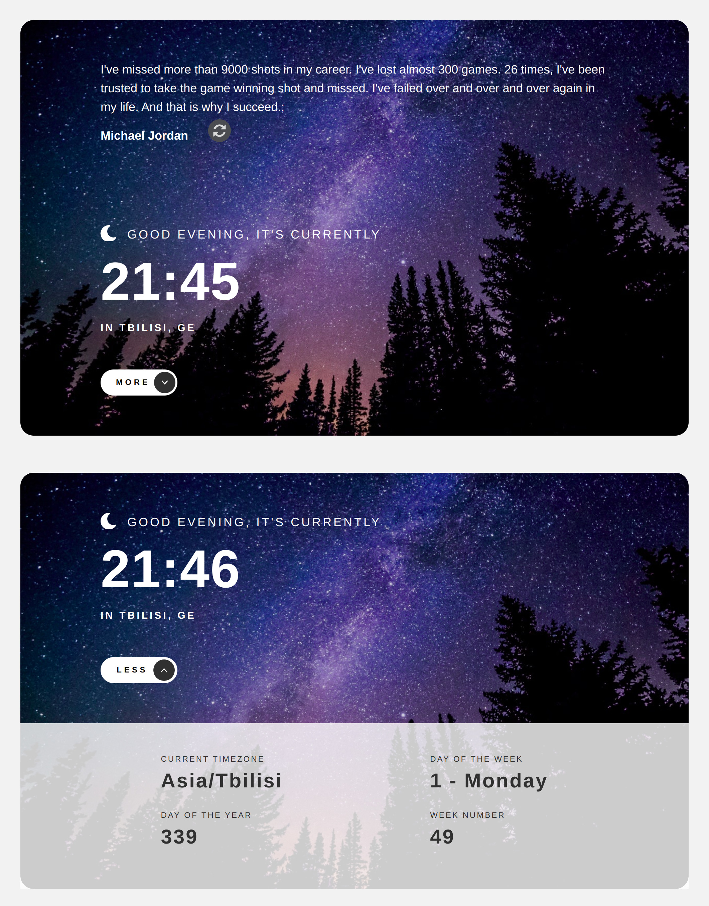

# Clock app - React + TypeScript

## Table of contents

- [Overview](#overview)
  - [The challenge](#the-challenge)
  - [Screenshot](#screenshot)
  - [Links](#links)
- [My process](#my-process)
  - [Built with](#built-with)
- [Author](#author)

## Overview

### The challenge

Users should be able to:

- View the optimal layout for the site depending on their device's screen size
- View the current time and location information based on their IP address
- View additional information about the date and time in the expanded state
- Be shown the correct greeting and background image based on the time of day they're visiting the site
- Generate random programming quotes by clicking the refresh icon near the quote

- Change the greeting depending on the time of day. It should say:
  - "Good morning" between 5am and 12pm
  - "Good afternoon" between 12pm and 6pm
  - "Good evening" between 6pm and 5am
- Change the greeting icon and background image depending on the time of day. They should show:
  - The sun icon and the daytime background image between 5am and 6pm
  - The moon icon and the nighttime background image between 6pm and 5am
- Generate a new random programming quote whenever the refresh icon is clicked

### Screenshot

Device 375px/700px/1200px

### Links

- Solution URL: [GitHub](https://github.com/Giorgi-Jalali/clock-app-react-ts/tree/master)
- Live Site URL: [GitHub Pages](http://giorgi-jalali.github.io/clock-app-react-ts)

## My process

### Built with

- Mobile-first workflow
- [React](https://reactjs.org/) - JS library
- [TypeScript](https://www.typescriptlang.org/) - for types
- [Styled Components](https://styled-components.com/) - For styles

## Author

- LinkedIn - [Giorgi Jalali](https://www.linkedin.com/in/giorgi-jalali-0336b8225/)
